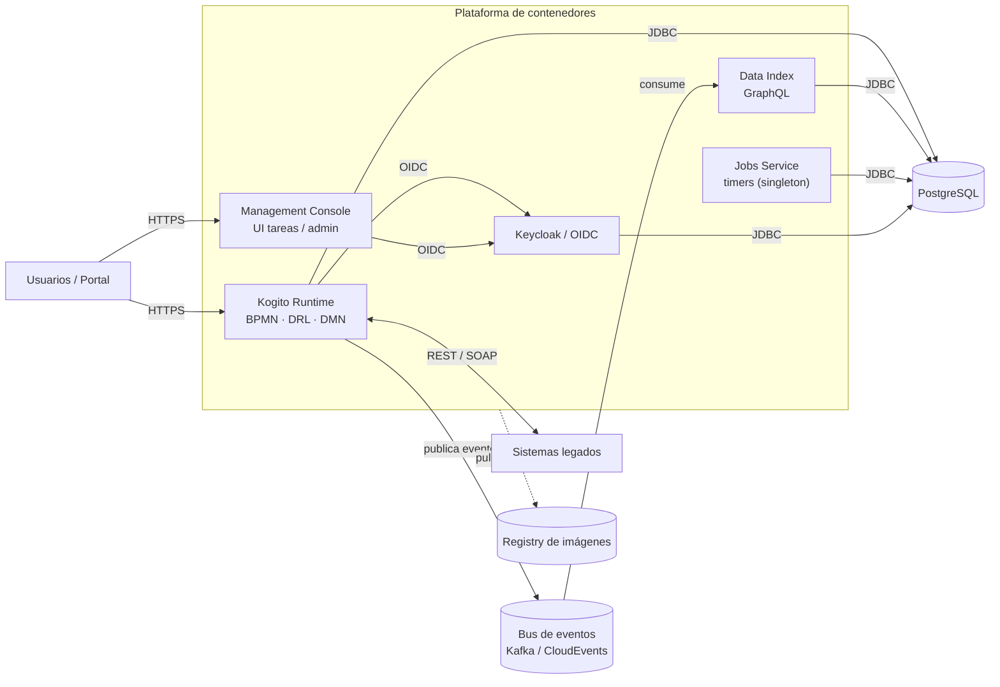

# Caso de estudio — Arquitectura de un BPM bancario con Apache KIE / Kogito

> Documento didáctico y **anonimizado**. Describe, con fines de enseñanza, la arquitectura de una solución de automatización de procesos de negocio (BPM) en una institución financiera genérica. No contiene datos de ningún cliente real; los números son ilustrativos.

El ejemplo de código del curso (`ejemplo/`) es una **porción simplificada** de la arquitectura que se describe aquí. Este documento da el contexto "del mundo real" que enmarca lo que se construyó en los Módulos 5 y 6.

---

## 1. Contexto y problema

Una institución financiera necesita **automatizar procesos internos** que hoy se llevan con correos, hojas de cálculo y pasos manuales: por ejemplo, **apertura de cuenta** y **aprobación de crédito**. Estos procesos comparten una forma común:

- Tienen **pasos en secuencia** con responsables distintos (captura → validación → aprobación de primera línea → aprobación de segunda línea → alta).
- Mezclan **decisiones automáticas** (reglas de negocio: ¿cumple el ingreso mínimo?, ¿el score es suficiente?) con **tareas humanas** (un gestor revisa y aprueba).
- Necesitan **trazabilidad** (quién hizo qué y cuándo) y **integración** con sistemas existentes.
- Las **reglas cambian** con frecuencia (políticas, montos, segmentos), y no debería requerir reescribir la aplicación cada vez.

Ese conjunto de necesidades es exactamente lo que resuelve un **BPM (Business Process Management)**: orquestar procesos (BPMN), evaluar reglas (DRL/DMN) y gestionar tareas humanas, con trazabilidad y APIs.

## 2. Por qué Apache KIE / Kogito

**Apache KIE / Kogito** es la evolución cloud-native de jBPM/Drools. En lugar de un servidor monolítico, cada proceso/decisión se compila en un **microservicio** con API REST autogenerada. Aporta:

- **BPMN 2.0** para procesos, **DRL/DMN** para reglas/decisiones — estándares, editables por negocio.
- **Generación de código en build** (no interpretación en runtime) → arranque rápido, apto para contenedores.
- Corre sobre **Quarkus o Spring Boot** (este curso usa Spring Boot; ver §7).
- Ecosistema de servicios de apoyo: índice de consulta, *jobs*, consola de tareas.

## 3. Componentes de la solución

| Componente | Rol | Notas |
|---|---|---|
| **Kogito Runtime** | Ejecuta los procesos (BPMN) y reglas (DRL/DMN); expone REST autogenerado | El corazón; se escala horizontalmente |
| **Data Index** | Índice consultable (GraphQL) de instancias y tareas | Es **índice operativo**, no almacén permanente ni log de auditoría |
| **Jobs Service** | Timers y trabajos programados del motor | **Instancia única (singleton)** por diseño → se atiende con reinicio/alertas, no escalado horizontal |
| **Management Console** | UI de administración + bandeja de tareas humanas | En KIE 10.x la Task Console se consolidó aquí |
| **Identidad (Keycloak / OIDC)** | Autenticación y roles | Centraliza el acceso de usuarios y servicios |
| **PostgreSQL** | Persistencia relacional (estado de procesos, datos de negocio) | Requiere alta disponibilidad en producción |
| **Bus de eventos (Kafka)** | Eventos del motor en formato **CloudEvents** | Alimenta el Data Index; integra con otros sistemas |
| **Registry de imágenes** | Almacén de imágenes de contenedor | Las imágenes se publican aquí y la plataforma las descarga |
| **Plataforma de contenedores** | Orquesta los workloads | On-premise (OpenShift) o nube (ver §6) |

## 4. Topología lógica

## 5. Recorrido de una solicitud (flujo)

1. El usuario (o un sistema) hace `POST` al **Runtime** → se crea una **instancia de proceso** (p. ej. `solicitudCuenta`).
2. El proceso ejecuta **tareas automáticas** (un *service task* invoca un servicio de negocio, p. ej. evaluación de riesgo) y/o **reglas** (DRL/DMN).
3. Llega a una **tarea humana** (aprobación de primera línea). Un gestor la atiende desde la **Management Console** (autenticado vía **OIDC**).
4. Cada cambio emite **eventos** al **bus** (CloudEvents); el **Data Index** los consume y mantiene un índice consultable por **GraphQL**.
5. El estado se persiste en **PostgreSQL**. Los **timers** (p. ej. "si no se aprueba en 48 h, escalar") los maneja el **Jobs Service**.
6. Al completarse, el proceso puede **integrar** con sistemas legados (REST/SOAP) y termina.

## 6. On-premise (OpenShift) → nube (Azure)

La misma arquitectura puede vivir on-premise o en la nube. Para la academia se mapea a **Azure**:

| On-premise (OpenShift) | Equivalente en Azure |
|---|---|
| OpenShift (cómputo) | Azure Container Apps (o AKS) |
| Registry de imágenes | Azure Container Registry (ACR) |
| PostgreSQL en VM | Azure Database for PostgreSQL Flexible Server |
| MongoDB (si aplica) | Azure Cosmos DB for MongoDB |
| Bus de eventos (Kafka) | Azure Event Hubs (API Kafka) |
| Identidad (Keycloak/OIDC) | Microsoft Entra ID (o Keycloak en contenedor) |
| Secretos de plataforma | Azure Key Vault |
| Despliegue (Helm) / CI-CD | Bicep o Terraform + GitHub Actions |

> **Lo importante (didáctico):** el **código de la aplicación no cambia** entre on-premise y nube — cambia la **configuración de conexión** (perfiles/variables de entorno). Es la misma lección que vimos en local: el ejemplo corre con H2 o con PostgreSQL real solo cambiando el perfil.

## 7. Decisiones de arquitectura (y su porqué)

Presentadas como decisiones razonadas — el "por qué" es lo valioso para el alumno.

1. **Microservicios por proceso, no un servidor monolítico.** KIE 10.x compila cada proceso/decisión en su propio servicio. *Por qué:* despliegue independiente, escalado fino, arranque rápido en contenedores.
2. **PostgreSQL como persistencia relacional.** *Por qué:* cobertura homogénea del stack (Runtime, Data Index, Jobs), madurez, soporte. En producción exige **HA**.
3. **Data Index es índice, no almacén permanente.** *Por qué:* está pensado para consulta/gestión operativa; si se requiere auditoría histórica, se define un repositorio/archivo aparte (no recae en Data Index).
4. **Bus de eventos externo al clúster, operado por otra área.** *Por qué:* separación de responsabilidades; el BPM solo configura el **cliente** (tópicos, productores/consumidores, seguridad), no opera el bus.
5. **Secretos nativos de la plataforma.** *Por qué:* simplicidad y menor superficie; no se añade un gestor externo si la plataforma ya cubre la necesidad.
6. **Jobs Service como instancia única (singleton).** *Por qué:* garantiza ejecución única de timers/jobs. *Implicación:* su continuidad se atiende con reinicio automático, *PodDisruptionBudget*, monitoreo y alertas — **no** con escalado horizontal.
7. **Identidad centralizada vía OIDC.** *Por qué:* un solo punto de autenticación/roles para usuarios y servicios.
8. **Runtime: Quarkus o Spring Boot.** El sistema real usa **Quarkus**; **este curso usa Spring Boot** porque el temario enseña Spring. Kogito soporta ambos de primera clase — la arquitectura y el modelado BPMN/DRL son **idénticos**; cambia el framework anfitrión y sus *starters*. Es justo el puente entre "el caso real" y "lo que construimos".

## 8. Capas de almacenamiento y dimensionamiento

Un error común es meter todo en la base de datos. Conviene **separar capas** por su patrón de crecimiento:

| Capa | Qué guarda | Crecimiento | Magnitud típica |
|---|---|---|---|
| **PostgreSQL / Data Index** | Metadatos, estado de proceso/tarea, referencias, índices | Instancias × tamaño de fila × retención | Moderada — orden de **GB** |
| **Almacenamiento de objetos** | Evidencias binarias (documentos, fotos) | Nº de archivos × tamaño medio × retención | Alta — orden de **TB** |

> Las evidencias binarias **no** van en la base de datos: van a un almacén de objetos (en nube, *blob storage*), y en la BD queda solo la **referencia**. Método de sizing de la capa estructurada: `disco ≈ base + Σ(instancias × footprint_fila × (1 + overhead_índices)) sobre la retención + holgura`. (Cifras concretas dependen del volumen real del negocio.)

## 9. Atributos de calidad (no funcionales)

- **Alta disponibilidad:** réplicas de Runtime/Data Index/Console; PostgreSQL con replicación; Jobs Service con failover controlado (es singleton).
- **Seguridad:** OIDC para acceso; secretos gestionados por la plataforma; TLS en tránsito; reglas de red para lo que cruza el borde del clúster (BD, bus, legados).
- **Observabilidad:** métricas (Prometheus/Micrometer), trazas (OpenTelemetry), alertas por degradación.
- **CI/CD:** build fuera del clúster → imagen al registry → despliegue declarativo (Helm on-prem; Bicep/Terraform + GitHub Actions en nube).

## 10. Cómo el ejemplo del curso refleja esta arquitectura

| En la arquitectura real | En `ejemplo/` (curso) |
|---|---|
| Kogito Runtime (procesos + reglas) | Procesos `solicitudCuenta` (tarea humana) y `evaluacionRiesgo` (service task) sobre Spring Boot |
| Tareas humanas + Console | Tareas de aprobación de primera/segunda línea (probadas en `SolicitudCuentaProcessTest`) |
| Service task → servicio de negocio | `EvaluacionRiesgoService` invocado desde el proceso |
| Persistencia relacional | `Cliente` con Spring Data JPA (H2 en dev, PostgreSQL real con perfil `postgres`) |
| Almacén documental | Bitácora de eventos en MongoDB (`EventoSolicitud`) |
| Procesamiento masivo | Job de Spring Batch (alta de clientes desde CSV) |
| API REST | REST autogenerado del proceso + `ClienteController` propio |

Lo que el curso **simplifica a propósito** (para no perder el foco del temario Spring): Data Index/GraphQL, Jobs Service como workload aparte, el bus de eventos productivo y la Management Console se mencionan como arquitectura, pero no se despliegan — el ejemplo corre como **un** servicio Spring Boot con persistencia en memoria/contenedores locales.

## 11. Glosario

- **BPM / BPMN:** gestión / notación de procesos de negocio.
- **DRL / DMN:** lenguaje de reglas / estándar de decisiones.
- **CloudEvents:** formato estándar de eventos.
- **OIDC:** OpenID Connect (autenticación sobre OAuth2).
- **Service task:** paso del proceso que invoca código/servicio (vs. *user task*, que requiere a una persona).
- **Singleton (workload):** componente con una sola instancia por diseño.
